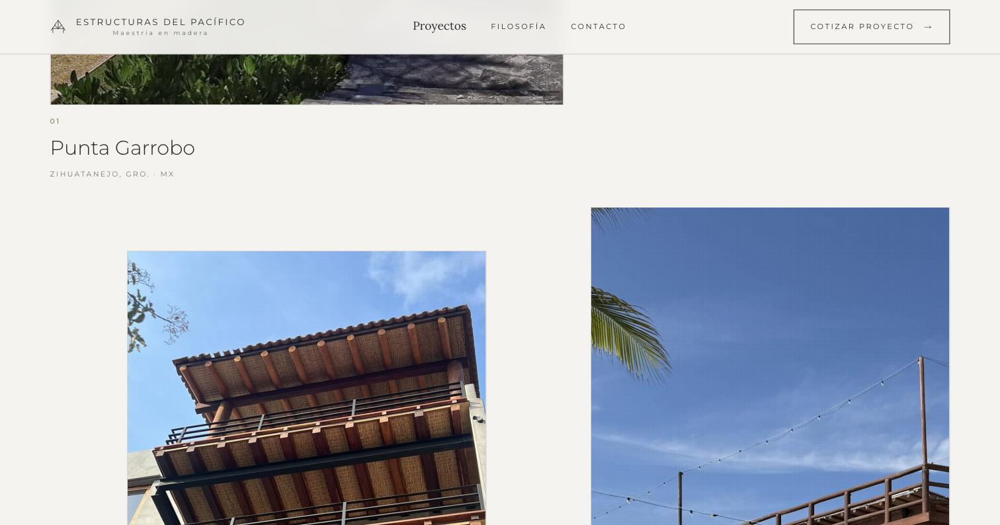

<h1 align="center">Alan Cervantes</h1>

iOS · backend · AI agents · Mexico City

I build products that run on their own: apps that act at the right moment instead of waiting to be opened.
By day I work on iOS build and release engineering at Audible (Amazon). By night I ship with AI coding agents, fast, and measure whether it worked.

### Now: Pacer

**[Pacer](https://github.com/4lxn/pacer)** runs your day so you don't have to. It asks *"did it happen?"* from the lock screen, moves what didn't with travel time and calendar in mind, and closes gym blocks from Apple Health without a tap. iOS 26, Swift 6, local-first: your data stays on your phone.

  
  
  

### Also new: motion-explainer

**[motion-explainer](https://github.com/4lxn/motion-explainer)** turns *"explain this"* into a motion-graphics animation you can pause, step through and zoom into. A Claude Code skill: Claude storyboards the steps, builds one self-contained HTML player, lints it, reviews a screenshot of every step, and can narrate it in English or Spanish with local voices. Open source, MIT.

  

Made from one prompt: <i>"Explain a login flow. Icon on every box, a terminal mockup for the curl call, a latency chart, zoom into the auth service, hud theme."</i> · <a href="https://4lxn.github.io/motion-explainer/login-flow.html">play it</a> · <a href="https://4lxn.github.io/motion-explainer/">more demos</a>

### Also
- **[Keystone](https://github.com/4lxn/keystone)** — an AI sales agent for real-estate developers and the CRM their advisors work from: answers leads on WhatsApp and Telegram from the real price list, books the visit, steps aside when a human takes over. Python/FastAPI, Postgres, React. Live for a client since June 2026.
- **[Estructuras del Pacífico](https://estructurasdelpacifico.com)** ([repo](https://github.com/4lxn/edp)) — bilingual site and photo galleries for a tropical-timber architecture studio in Zihuatanejo.

  

  
  

### How I work

Small write paths, pure logic with tests, local-first by default, one honest doc per project (thesis, gates, gaps). I use Claude Code as a pair and say so in every README.

alangibrancs@icloud.com

